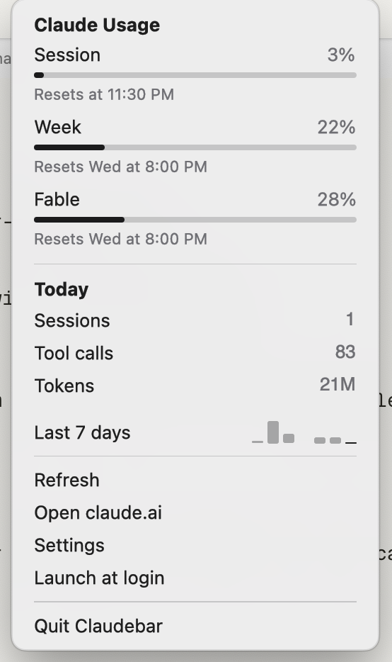

# claudebar

A macOS menu bar view of your Claude usage limits, written in Rust with [GPUI](https://www.gpui.rs/).
Sibling of [daybar](https://github.com/gautham-v/daybar) and
[mailbar](https://github.com/gautham-v/mailbar): same stack, same visual language.

The menu bar shows one number and a small ring: how much of your current five-hour session you
have used (or the weekly limit, if you would rather track that), sitting the way the battery item
does, percentage first and glyph after. The ring is drawn at runtime as a template image, so it
tints itself for light and dark like the system glyphs do; with 20% or less of the window left,
both the number and the ring go red. Click it and a 260px popover drops down, shaped like the
system Battery menu: a thin bar per limit
(session, week, and one per model your plan meters separately) with when each one resets under
it. Under that, what you did today — sessions, tool calls and tokens — and a seven-bar
sparkline of the last week, read straight out of the Claude Code session logs on this machine.
Then plain menu rows: Refresh, Open claude.ai, Settings, Launch at login and Quit. The whole
surface is ink on the system material; the only colour in it is the red a bar goes when the
window is nearly spent. No Dock icon, no windows.

It follows the system light/dark appearance.



<!-- Captured from the running app (real numbers). `cargo run --example popover_preview` renders
     the same view over stub data if you want to retake it without a token. -->

## Build and run

Requires Rust stable and Xcode (GPUI needs the Metal toolchain:
`xcodebuild -downloadComponent MetalToolchain` if the build complains).

```sh
make run      # release build → target/Claudebar.app → open it
make bundle   # just build the .app
make install  # copy to /Applications and relaunch from there
make test     # cargo test
make check    # cargo fmt --check && cargo clippy --all-targets -D warnings
```

`make run` kills any running copy first. To see the UI without the menu bar, a token or a
single log file, against stub data:

```sh
cargo run --example popover_preview -- ready|nearly-out|signed-out|loading|error|settings
```

## Settings

claudebar runs with no configuration. What little there is to choose lives behind the popover's
**Settings** row, which expands in place — a **Menu bar shows** group with one row per limit
(Session, Week, and each model your plan meters separately) and a **Show percentage** toggle —
and is written to
`~/.config/claudebar/config.toml`, which you can also edit by hand:

| key | default | what it does |
|---|---|---|
| `menu_bar` | `"session"` | which limit the menu bar item tracks: `"session"`, `"weekly"`, or a model display name as the API spells it, e.g. `"Fable"` |
| `show_percent` | `true` | `false` shows the ring alone, with no number beside it |
| `low_remaining_percent` | `20.0` | how little of a window has to be left before the ring and the number go red |
| `refresh_minutes` | `5` | how often the limits and the local scan are refetched; read once at startup |

The Settings section writes that same file, so a choice made there survives a
relaunch. Every key is optional: a file with one line in it is a valid file, unknown keys are
ignored, and a file that does not parse is ignored with one muted line in the popover saying so
rather than stopping the app.

## Where the numbers come from

Two sources, both already on your machine. claudebar has no account of its own, no server, and
nothing to configure beyond the handful of display settings above.

**The limit bars** come from `GET https://api.anthropic.com/api/oauth/usage` — the same endpoint
Claude Code's own `/usage` command calls, with the same OAuth bearer token. That token is read
out of your login Keychain, from the item Claude Code already put there (service
`Claude Code-credentials`). claudebar only ever *reads* it: it never refreshes it, never writes
it back, and never copies it anywhere else. Claude Code owns that token and is the only thing
allowed to renew it, so if it has expired the popover says "Token expired — run `claude` to
refresh" rather than trying to fix it. With no Keychain item at all you get "Sign in with
`claude` in a terminal first", and the local blocks still render — they need no token. The
limits are refetched every 5 minutes and every time the popover opens.

**Today and the last 7 days** come from the Claude Code session logs in
`~/.claude/projects/*/*.jsonl`, read on a background thread, on your machine only. claudebar
counts assistant messages — deduped on request and message id, because a streaming message is
appended several times — for tokens, tool calls and how many sessions each local day had. Only
files touched in the last 8 days are opened, and only the last 7 local days are kept. Nothing
from those logs is sent anywhere: the only network request claudebar ever makes is the usage
one above.

### Launch at login

The popover has a **Launch at login** row, backed by `SMAppService` (macOS 13+). It shows
a checkmark whenever macOS reports the login item as enabled, so it agrees with
**System Settings › General › Login Items**, where Claudebar appears once it is on.

Two things follow from `SMAppService` registering a *path*:

- It only works from the bundled app. Under `cargo run` or the preview example there is no
  bundle, so the toggle is disabled with a note.
- Moving the `.app` afterwards leaves the login item pointing at the old location. Toggle it
  off and on again after a move.

Which is why `make install` is the recommended way to keep it around:

```sh
make install   # → /Applications/Claudebar.app, relaunched from there
```

### Code signing

The bundle is signed with the first identity `security find-identity -v -p codesigning`
reports, or with whatever `CODESIGN_IDENTITY` names:

```sh
CODESIGN_IDENTITY="Apple Development: ..." make bundle
```

A stable identity matters. An ad-hoc signature (`-`) gives every rebuild a different code
identity, so macOS treats each build as a brand-new app and re-prompts for access to the
Keychain item holding the Claude Code token on every single launch. With no identity on the
machine the script falls back to ad-hoc and says so. Switching from ad-hoc to a real identity
prompts once more for the existing item — choose **Always Allow** that first time and it stops
asking.

## Keys

| | |
|---|---|
| `r` | refresh |
| `Esc` | collapse the Settings section, then close the popover |

## Privacy

claudebar makes exactly one network request: the usage endpoint above, with the token Claude
Code already stores. It does not refresh, rewrite or export that token, and it writes no
credentials of its own. Your session logs are parsed locally and the numbers derived from them
never leave the machine. There is no telemetry and no analytics. claudebar writes two files of its
own: `~/.config/claudebar/config.toml`, which holds the display settings above, and
`~/Library/Caches/claudebar/usage.json`, the last limits it fetched (percentages and reset times,
never the token) so a relaunch has numbers to show before its first fetch lands.

The usage endpoint rate-limits. claudebar asks at most once a minute however often the popover is
opened, and when the API answers 429 it keeps the previous numbers up with a "Rate limited — will
retry" line until the next scheduled fetch.

## How it fits together

- `src/main.rs`, `src/status_item.rs` — the `NSStatusItem` and the popover window (anchored
  under the item, closed on Esc, outside click or focus loss), and the refresh timer (`refresh_minutes`).
- `src/menu_bar_icon.rs` — the ring glyph, drawn with Core Graphics.
- `src/model.rs` — `Usage`, `Limit`, `DayStats`, `LocalStats` and the formatting helpers (pure,
  unit-tested).
- `src/settings.rs` — `~/.config/claudebar/config.toml` and its defaults.
- `src/usage.rs` — the Keychain read, the request and the response parsing.
- `src/local.rs` — the session-log scan.
- `src/store_provider.rs` — the seam: both sources run on `cx.background_executor()` and
  re-render the popover and the menu bar icon on the main thread when they land.
- `src/ui/` — `popover.rs` over a `UsageProvider` trait, plus `stats` and `theme`.
- `scripts/bundle.sh` — builds `Claudebar.app`.

## License

MIT.
